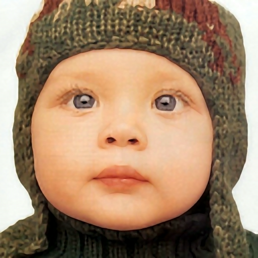

# SRLab

Single image super resolution algorithm implementation (in progress)

## Demo:

### Source(128X128)

### 4X

Project Home Page [here](https://schen59.github.io/#/SRLab)

More Project [Demo](http://shaofeng_2010.gegahost.net/SR/SingleImgSR.html)

## Requirement:
* Supported python version 2.7

* pip install Pillow

* pip install mock==1.0.1

* pip install six

* pip install -U numpy scipy scikit-learn

## Example:

    image = Image.open("test_data/babyface_4.png")

    sr_image = SRImageFactory.create_sr_image(image)

    reconstructed_sr_image = sr_image.reconstruct(2, 'iccv09')

    reconstructed_sr_image.save("test_data/babyface_sr.png", "png")

## Note:
Need to work more on performance, it will take around 20 seconds to reconstruct a 128*128 image to
2X its original size, and take around 1 minutes to 4X its original size.(On i7 Cpu, 8G ram)

### Run the examples in example/sr_image_example.py:

Add root directory of SRLab to PYTHONPATH:

    export PYTHONPATH=$PYTHONPATH:~/schen59/SRLab

Go to the example directory:

    cd example

Run the example script:

    python sr_image_example.py